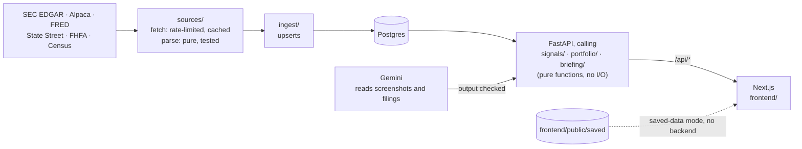

<div align="center">

# Precedence

**Start from what you own, and test whether the news ever mattered.**

[](https://github.com/I0B0M/Stone/actions/workflows/ci.yml)
[](LICENSE)


[What it does](#what-it-does) ·
[Quick start](#quick-start) ·
[How the test works](#how-the-signal-test-works) ·
[Architecture](#architecture) ·
[Contributing](CONTRIBUTING.md)

</div>

Built at ShellHacks 2026 for the Blackstone track, "Reimagining the Investor Experience".
Precedence is the product; `stone` is its code name (the Python package, the database and this repository).

## What it does

Investors have more information than ever, spread across filings, prices, rates and news. Precedence starts
from **what you own**, pulls those sources into one screen per holding, and **tests whether a kind of news has
ever actually mattered for that stock** before it asks for your attention. A holding stays **Calm** unless a
signal that passed the test is firing now; then it gets a **Heads up**.

It never predicts a price. When the history doesn't back a worry, it says "not proven", and every number on
screen carries its source and an as-of date.

One pill in the header switches between two views of the same data:

- **Lite** (default): plain words and dollars.
- **Pro**: the working shown: every past case, the hold-out, the multiple-testing correction, legal names and
  CIKs, and links to the filings.

## Features

| Screen | What you get |
|---|---|
| **Portfolio** `/portfolio` | One total for your stocks, ETFs, a 401(k), a home, and Blackstone's BREIT and BCRED. Funds are looked through to what they hold: SPY from State Street's daily file, and VOO, IVV and QQQ from their own SEC N-PORT filings. Also a risk card (QuantStats) and, in Pro, a "What you really own" treemap. |
| **Company** `/company/BX` | Price chart (candles in Pro), filings, financials from XBRL, insider sales, and each signal's verdict. Filing summaries by Gemini, with every figure checked against the filing's XBRL. |
| **Signals** `/signals` | Pick any stock and signal to see every past case, what followed, the hit rate against normal days, and its 90% range. |
| **Briefing** `/briefing` | A spoken briefing on what you own, with captions, under an animated orb. It's written by tested rules, not a language model, and every number in every line is checked. The saved briefing plays recordings made ahead of time with the open-weight Kokoro-82M voice; any other line is read by the browser's voice. |
| **Import** `/import` | Add holdings from a brokerage screenshot (Gemini reads it, and the rows must add up to the printed total), by typing them, or from the example portfolio. |
| **Paper trading** `/paper` | Try a trade with pretend money at Friday's close. No order is ever sent. |

Holdings you enter stay in your browser (`localStorage`). The API prices them on request and doesn't store them.
A screenshot you import goes to Google's Gemini API, and the answer is cached on the server's disk.

## Quick start

Step-by-step guides, from putting the demo site on Netlify to the full app with local models and a tunnel, are in
[`docs/deploy/`](docs/deploy/README.md). The short version:

### The saved-data demo (no database, no keys)

Needs Node.js 22.

```bash
cd frontend
npm install
NEXT_PUBLIC_STONE_SAVED=1 npm run dev
```

Open <http://localhost:3000>. The app reads real API responses saved in `frontend/public/saved/` for the example
portfolio (BX, AAPL, NVDA, JPM, AMZN and SPY), priced at the close on Sep 25, 2026. This is what the Netlify build
serves (`netlify.toml`). Screenshot import and your own holdings need the full app.

### The full app

Needs Python 3.12+, [uv](https://docs.astral.sh/uv/), Node.js 22 and PostgreSQL 16.

```bash
createdb stone
cp .env.example backend/.env          # add keys as you connect sources; never commit this file
cd backend
uv sync
uv run python scripts/seed_sample.py  # fictional companies (HLCN, MRDN, ORCA, BRVE, BRD500) for development
uv run uvicorn stone.api.main:app --reload --port 8000
```

In a second terminal:

```bash
cd frontend
npm install
npm run dev                           # http://localhost:3000; /api is proxied to STONE_API_URL (default :8000)
```

Every database row has a `source`. While any sample rows exist, the app shows a SAMPLE DATA banner.

### Real data

Set `SEC_USER_AGENT`, `ALPACA_API_KEY`, `ALPACA_API_SECRET` and `FRED_API_KEY` in `backend/.env`, and use a
database with no sample rows (`seed_sample.py --clear` removes them). Then, from `backend/`:

```bash
uv run python scripts/ingest_all.py            # SEC filings, XBRL, Form 4s, daily prices, DGS10
uv run python scripts/load_form4s.py           # Form 4s for the stocks beyond the first 20
uv run python scripts/ingest_etfs.py           # SPY's holdings (State Street)
uv run python scripts/ingest_nport.py          # QQQ, VOO and IVV holdings (SEC N-PORT; after ingest_etfs)
uv run python scripts/ingest_private_funds.py  # BREIT and BCRED NAVs and distributions (SEC EDGAR)
uv run python scripts/ingest_hpi.py            # FHFA house price index, for home estimates
uv run python scripts/scan_signals.py          # test every stock and record the scan
```

Every raw response is cached under `data/cache/<source>/` and every write is an upsert, so a re-run only fetches
what's missing, and `--offline` rebuilds from the cache. A cold run over the S&P 100 takes about 35 minutes,
mostly Form 4 XML at 8 requests a second. With `GEMINI_API_KEY` set, `uv run python scripts/check_gemini.py`
reads the demo screenshot end to end and checks that it adds up.

### Configuration

All settings are environment variables, read from `backend/.env` for the backend. [`.env.example`](.env.example)
lists them.

| Variable | Used for | Notes |
|---|---|---|
| `DATABASE_URL` | the backend | Default `postgresql://localhost:5432/stone` |
| `SEC_USER_AGENT` | SEC EDGAR | A contact email, which SEC requires. No key. |
| `ALPACA_API_KEY`, `ALPACA_API_SECRET` | Daily prices | Free paper-account key (IEX feed) |
| `FRED_API_KEY` | The 10-year Treasury yield | Free key |
| `GEMINI_API_KEY` | Screenshot import, filing summaries | Free AI Studio key; backend only |
| `GEMINI_MODEL` | Which Gemini model | Optional; default `gemini-3.8-flash` |
| `STONE_API_URL` | The frontend | Where `/api/*` is proxied; default `http://localhost:8000` |
| `NEXT_PUBLIC_STONE_SAVED` | The frontend | `1` = saved-data mode with no backend |
| `TEST_DATABASE_URL` | Tests | Default `postgresql://localhost:5432/stone_test` |
| `STONE_READERS`, `STONE_SUMMARY_MODEL`, `OLLAMA_URL` | v2 | Off by default; see [After the hackathon](#after-the-hackathon-v2) |

`NEXT_PUBLIC_*` values are compiled into the browser bundle, so never put a key in one.

## How the signal test works

Precedence tests three kinds of news for each holding, over about two years of daily prices:

| Signal | A case is | Horizon | A hit is |
|---|---|---|---|
| Insider selling cluster | 3 or more Form 4 filings with an open-market sale within 10 days | 20 trading days | the stock ended lower |
| Rate jump | the 10-year Treasury yield (DGS10) up 0.15 points or more on a week earlier | 5 trading days | the stock did worse than SPY |
| Gap down | the stock opens 5% or more below the previous close | 20 trading days | the stock ended lower |

1. **Timing.** Each case starts at the next market open after the public could know about it: SEC's acceptance
   time for filings, and 16:15 ET on the next weekday for DGS10. Overlapping cases count once.
2. **Normal days.** The hit rate is compared with the stock's own normal days: start days whose whole horizon
   touches no case.
3. **Label.** The hit rate gets a 90% Wilson range. With under 10 cases the label is **WEAK**. It's **STRONG**
   only when the range's low end beats the normal rate, and **NOT PROVEN** otherwise. When the source isn't loaded
   for that stock, the label is **NO DATA**, never "hasn't happened".
4. **State.** A holding gets a **Heads up** (WATCH in the API) only when a STRONG signal is firing now. Otherwise
   it's **Calm**.
5. **Checks shown in Pro.** A split-half hold-out ("held up" needs 10+ cases in each half); a stricter test
   (Newcombe) that marks a STRONG label *borderline* without changing it; and, across the whole scan, how many
   STRONG labels survive Benjamini-Hochberg at a 10% false discovery rate.

The thresholds are constants in [`backend/stone/signals/engine.py`](backend/stone/signals/engine.py), and nothing is
tuned per stock. The words above have exact meanings, defined in [`CONTEXT.md`](CONTEXT.md).

**The honest result.** In the scan of Sep 26, 2026 (prices to Sep 25), 11 of the 115 stock-signal pairs with 10+
cases came out STRONG, where about 6 would be expected by chance, and none survived the correction. Pro says so.
Saying "not proven" when the history doesn't back the worry is the point of the product.

## The briefing: a panel of experts, every number checked

`GET /api/briefing/{ticker}` and `POST /api/briefing/portfolio` return a short spoken script. Experts, each one a
tested rule, read one kind of evidence: signals, the market, risk, look-through, figures, filings and insiders.
Each proposes points with a salience. A gate speaks the most salient first, within a line budget and a cap per
expert, and lists what it held back and why. It's shaped like a mixture of experts, but no model is trained or
called, because 15 to 50 past cases per stock can't train one
([ADR 0001](docs/adr/0001-briefing-is-rules-not-a-language-model.md)). Every line is one sentence of at most 28
words, and every number it prints must round-trip to a value in its evidence (`check()` in
`backend/stone/briefing/lines.py`). A point that fails is never spoken, and the saved-data build stops. For the
saved-data demo, `build_saved.py` writes the same JSON to `frontend/public/saved/briefing/`.

## Architecture



| Path | What's there |
|---|---|
| `backend/stone/sources/` | One client per outside source, split into **fetch** (cached HTTP through `stone/fetch.py`) and **parse** (pure functions, unit-tested against small sample files) |
| `backend/stone/ingest/` | Loads parsed rows into Postgres. Every write is an upsert, so re-runs are safe |
| `backend/stone/signals/` | The signal engine and the scan. No I/O, fully unit-tested |
| `backend/stone/portfolio/` | Exposure (including what you hold inside funds), the screenshot reconcile check, the risk card |
| `backend/stone/briefing/` | Experts, the gate and the number check for the spoken briefing. No I/O |
| `backend/stone/readers/` | v2: trained models that propose cases for the engine to test, off by default |
| `backend/stone/api/` | The FastAPI app |
| `backend/scripts/` | Ingest, scan, saved-data build, Gemini and calibration checks, the mutation check |
| `backend/tests/` | pytest suite. `tests/fixtures/` holds small sample responses; its README says which are real |
| `frontend/` | Next.js 16 (App Router), React 19, TypeScript |
| `frontend/public/saved/` | Saved API responses for the no-backend demo (generated; don't edit by hand) |
| `docs/` | Decisions (ADRs), the v2 plan and research notes; start at [`docs/README.md`](docs/README.md) |

## Testing

The backend tests need a Postgres database named `stone_test`. They create the schema and fictional rows themselves.

```bash
createdb stone_test
cd backend
uv run pytest
bash scripts/mutation_check.sh   # breaks one engine or briefing rule at a time; every line must say "killed"
```

```bash
cd frontend
npm run lint
npm test                         # Vitest
npm run build                    # also type-checks
```

CI runs all of these on every pull request and every push to `main` ([`.github/workflows/ci.yml`](.github/workflows/ci.yml)).

## What works today, and what doesn't

**Works:**
- Real data for 103 S&P 100 stocks plus SPY and QQQ: SEC filings, XBRL financials, Form 4 insider sales, two
  years of daily prices and the 10-year Treasury yield, with fund holdings for SPY, VOO, IVV and QQQ.
- The signal engine, the hold-out, the stricter test and the scan's Benjamini-Hochberg count, cross-checked against
  statsmodels in the tests.
- Portfolio with look-through, a home estimate, a 401(k), BREIT and BCRED; company pages; Signals; the spoken
  Briefing; screenshot import with its reconcile check; paper trading with pretend money.
- A saved-data demo that runs with no backend.

**Doesn't, yet:**
- No hosted backend. The public demo is saved data at one market close, so screenshot import and your own
  holdings need the full app on your machine.
- No price prediction, and no model decides what you're told. Gemini only reads (screenshots, filings) and what it
  reads is checked; Kokoro-82M only voices lines that are already written; the v2 FinBERT Reader is off by default.
- Connecting a brokerage account (SnapTrade) isn't built.
- Prices come from the IEX feed, a small share of US volume, so an open or close can differ slightly from the
  consolidated price. We haven't measured by how much.
- The S&P 100 list is 2025 membership.

## Data sources

| Source | Key | Limit | Used for |
|---|---|---|---|
| SEC EDGAR (submissions, companyfacts, Form 4, N-PORT) | none, contact email in User-Agent | 10 req/s (we use 8) | Filings, financials, insider sales, fund holdings (VOO, IVV, QQQ), BREIT and BCRED NAVs and distributions |
| Alpaca Market Data (IEX feed) | free paper-account key | 25 symbols per request | 2 years of daily prices (split-adjusted) |
| FRED | free key | generous | 10-year Treasury yield (DGS10) |
| State Street (SSGA) daily SPY holdings file | none | one file a day, cached | What SPY holds, for looking through the fund (shown with its "as of" date) |
| FHFA House Price Index (ZIP, county, state) | none | files cached | Home estimates |
| US Census Geocoder | none | cached | Finding a home's location from its address |
| OpenStreetMap tiles | none | [tile usage policy](https://operations.osmfoundation.org/policies/tiles/) | The map on the home card (credited on the map) |
| Google Gemini API (`gemini-3.8-flash`, set by `GEMINI_MODEL`) | free AI Studio key | free-tier quota, cached per image and filing | Reading holdings off a screenshot (checked against its printed total); plain filing summaries (every figure checked against the filing's XBRL) |
| Yahoo Finance (through yfinance) | none | `build_saved.py` only | SPY's daily bars and the stocks' daily high/low in the saved-data demo, labeled as Yahoo Finance |

## Built with

Everything else in this repo was written by the team, at the event and in the v2 work after it.

| Library | License | Used for |
|---|---|---|
| FastAPI | MIT | HTTP API |
| Uvicorn | BSD-3 | API server |
| psycopg 3 | LGPL-3 | Postgres driver |
| python-multipart | Apache-2.0 | Screenshot uploads |
| httpx | BSD-3 | HTTP client for outside APIs |
| python-dotenv | BSD-3 | Reading `.env` |
| QuantStats | Apache-2.0 | Risk card: volatility, max drawdown, beta, Sharpe, worst day |
| pandas, NumPy, SciPy | BSD-3 | Used by QuantStats; SciPy also checks the engine's binomial tail in tests |
| pytest | MIT | Tests |
| statsmodels | BSD-3 | Tests only: the engine's Wilson range and Benjamini-Hochberg must match it |
| yfinance | Apache-2.0 | `scripts/build_saved.py` only: SPY's daily bars and the stocks' high/low for the saved-data demo (labeled Yahoo Finance) |
| Pillow | MIT-CMU | Drawing the demo screenshot (`scripts/make_demo_screenshot.py`, one-off) |
| Next.js | MIT | The web app |
| React | MIT | UI |
| TypeScript | Apache-2.0 | Types |
| TradingView Lightweight Charts | Apache-2.0 | Pro candles on the company page (keeps TradingView's attribution logo) |
| d3-hierarchy | ISC | The "What you really own" treemap layout |
| driver.js | MIT | The guided tour |
| three.js | MIT | The Briefing tab's orb (renderer ported from Eno, MIT) |
| Vitest | MIT | Frontend unit tests (`npm test`) |
| ESLint | MIT | Frontend lint |
| Epilogue, Alegreya, Doto (Google Fonts, via `next/font`) | SIL OFL 1.1 | Type |
| Hugging Face Transformers, PyTorch | Apache-2.0, BSD-3 | Optional, v2: the FinBERT tone Reader (`scripts/read_filings.py`); not installed by default |
| ProsusAI/finbert (model) | see its model card | Optional, v2: reads 8-K text as negative/neutral/positive |
| Ollama | MIT | Optional, v2: a local model for filing summaries (`STONE_SUMMARY_MODEL=ollama:<model>`) |
| Kokoro-82M (hexgrad) | Apache-2.0 | The Briefing's voice: an open-weight speech model that reads the saved briefing's lines ahead of time (`scripts/build_voice.py`, one-off), so the tab plays recordings instead of the browser's voice |
| misaki, PyTorch | Apache-2.0, BSD-3 | Used by Kokoro (pronunciation, running the model); `scripts/build_voice.py` only |

## Research used

- Boudoukh, Feldman, Kogan & Richardson, "Which News Moves Stock Prices? A Textual Analysis",
  NBER w18725, Table 3 (news-type weights).
- Wilson (1927), "Probable Inference, the Law of Succession, and Statistical Inference", JASA 22:209
  (the 90% range for a hit rate).
- Newcombe (1998), "Interval estimation for the difference between independent proportions",
  Statistics in Medicine 17:873, method 10 (the stricter test shown in Pro).
- Benjamini & Hochberg (1995), "Controlling the False Discovery Rate", JRSS B 57:289 (the scan's 10% FDR count).

## After the hackathon (v2)

[`docs/v2-plan.md`](docs/v2-plan.md) is the accepted plan: trained finance models come in only as **Readers** that
propose cases for the same engine to test ([ADR 0002](docs/adr/0002-readers-propose-the-engine-tests.md)).
Accuracy means calibration (`scripts/calibration_check.py`), reading accuracy (`scripts/eval_screenshots.py`) and
grounded narration, never price prediction. The first Reader, FinBERT tone on 8-K text, is wired in behind
`STONE_READERS=1`, and a local summarizer through Ollama sits behind `STONE_SUMMARY_MODEL`. The backend ships as
`backend/Dockerfile` with `render.yaml` and `.do/app.yaml`, and Netlify's `live` branch context points the frontend
at it.

| Milestone | What |
|---|---|
| M1 | Cloud database and the `live` Netlify context, so everything on `main` works end to end on real data |
| M2 | FinBERT tone signal, placebo calibration, and the accuracy numbers in this README |
| M3 | Filing summarizer with the XBRL figure check |
| M4 | Screenshot evaluation set and its number |
| M5 | Model phrasing of briefing lines, if ever, behind the grounding check |

## Contributing

Issues and pull requests are welcome. Start with [CONTRIBUTING.md](CONTRIBUTING.md): it covers setup, the checks
every change must pass, and the rules that keep the numbers honest. Please follow the
[Code of Conduct](.github/CODE_OF_CONDUCT.md), and report security problems privately as described in
[SECURITY.md](.github/SECURITY.md). Questions go to [SUPPORT.md](.github/SUPPORT.md).

## Team

Built by [@I0B0M](https://github.com/I0B0M) and [@blondres04](https://github.com/blondres04) at ShellHacks 2026.

## License and disclaimer

The code is released under the [MIT License](LICENSE). Data from outside sources stays under its providers'
terms. This product uses the FRED® API but is not endorsed or certified by the Federal Reserve Bank of St. Louis;
see the [FRED® API Terms of Use](https://fred.stlouisfed.org/docs/api/terms_of_use.html).

**Precedence is not investment advice.** It's a research and learning tool. It shows what happened after past
events, which doesn't say what will happen next. Paper trading uses pretend money, and no order is ever sent.
